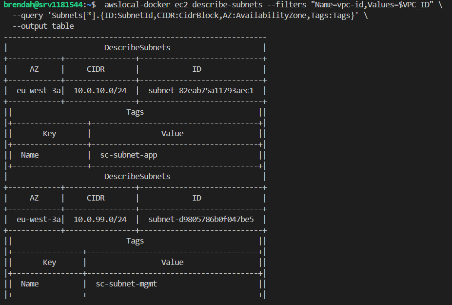

drwxr-xr-x 3 brendah brendah  4096 Sep  1 08:41 .
drwx------ 8 brendah brendah  4096 Aug 31 14:58 ..
drwxr-xr-x 2 brendah brendah  4096 Aug 31 14:59 aws
-rw------- 1 brendah brendah     0 Sep  1 07:51 batchMLScript.py
-rwxr-xr-x 1 brendah brendah   155 Aug 31 14:59 build-all.sh
-rw------- 1 brendah brendah 64982 Aug 31 15:01 build.log
-rw------- 1 brendah brendah   834 Aug 31 15:01 build-runner.log
-rw-r--r-- 1 brendah brendah  2090 Aug 31 15:02 LISEZ-MOI.md
-rw-r--r-- 1 brendah brendah  3547 Sep  1 08:41 main.pkr.hcl

Voici tous les fichiers pour build les images 
le aws est un dossier avec un main.pkr.hcl - build des image si on a un vrai aws
batchMLScript est un script utilisé pour activation du container del'image de batchML
build-all.sh estun script shell qui permet de build les images
    packer build . 2>&1 | tee "$HOME/amis/build.log" | grep -E "^==> |Imported Docker image|Error|error"

    Cette ligne enchaîne 3 commandes avec des pipes (|), qui font transiter la sortie de l'une vers l'entrée de la suivante :

    a) packer build .
    Lance Packer sur tous les fichiers .pkr.hcl du dossier courant (le . = dossier actuel). Construit vos 3 images (fastapi, rabbitmq, batchml).

    b) 2>&1
    Redirige le flux d'erreurs (stderr, descripteur 2) vers le même flux que la sortie standard (stdout, descripteur 1). Sans ça, si Packer affiche des erreurs, elles n'apparaîtraient pas dans la même chaîne de traitement que le reste (elles pourraient échapper au tee et au grep). Concrètement : ça fusionne "sortie normale" et "messages d'erreur" en un seul flux.

    c) | tee "$HOME/amis/build.log"
    tee est une commande qui fait deux choses en même temps :

    Elle affiche ce qu'elle reçoit à l'écran (comme le ferait cat)
    Elle enregistre aussi tout dans le fichier indiqué (build.log) 

build.log: les logs de tous les build
build-runner.log: 
main.pkr.hcl: 


exo 2: # UrbanHub — Architecture de stockage IoT (Groupe [X])

## Contexte
Sujet IoT : [pollution eau / air / trafic / bruit / énergie]
Volumétrie estimée : ~5 Go / 30 jours de données brutes capteurs
Environnement : simulation locale via Docker/Packer (pas de compte AWS facturé)

## Stratégie de cycle de vie des données

### Données brutes (raw/)
- **Durée de rétention : 30 jours**
- **Usage** : uniquement pour alimenter le pipeline d'agrégation (batch ML / traitement horaire)
- **Justification** : au-delà de 30 jours, le brut n'apporte plus de valeur — seuls les
  agrégats sont consultés pour les dashboards et analyses. Conserver le brut plus
  longtemps augmenterait le coût sans bénéfice métier.
- **Classe équivalente AWS** : S3 Standard (accès fréquent pendant les 30j), puis
  suppression (`expiration` lifecycle) plutôt que transition vers une classe froide,
  car ces données ne seront plus jamais relues.

### Données agrégées (processed/)
- **Durée de rétention : illimitée (conservation permanente)**
- **Usage** : dashboards, historique, rapports, conformité
- **Justification** : volume beaucoup plus faible que le brut (agrégation horaire/
  journalière), donc coût de stockage négligeable même en conservation longue.
- **Classe équivalente AWS** : S3 Standard en continu — accès toujours nécessaire,
  pas de bénéfice à transitionner vers une classe froide.

## Schéma du pipeline
[Capteurs IoT] --MQTT/RabbitMQ--> [sc-ingest] --raw/--> [Stockage 30j]
|
[sc-worker batch ML]
agrégation + nettoyage
|
v
[Stockage processed/ permanent]
|
[sc-api] --GetObject--> Dashboard

## Optimisations appliquées

| Levier | Implémentation | Gain estimé |
|---|---|---|
| Compression gzip | Appliquée avant écriture sur `raw/` et `processed/` | ~-40% volume |
| Déduplication | Hash SHA-256 du payload, skip si déjà présent | ~-25% doublons |
| Suppression auto raw/ | Nettoyage après 30j (cron / lifecycle simulé) | -100% sur le brut après 30j |

## Matrice d'accès (IAM simulé / permissions applicatives)

| Composant | Droit | Justification |
|---|---|---|
| sc-ingest | Écriture seule sur `raw/` | Ne doit jamais lire ni modifier les données existantes |
| sc-worker | Lecture `raw/` + écriture `processed/` | Seul composant à traiter le brut |
| sc-api | Lecture seule `processed/` | Sert uniquement les données déjà agrégées |
| Anonyme | Aucun accès | Refus explicite par défaut |

## Limites de l'environnement de simulation

- **Storage Lens** (visibilité FinOps native AWS) n'est pas disponible en local
  Docker/Packer. Une alternative a été mise en place : [script Python de reporting /
  console MinIO], produisant un rapport équivalent (volume par préfixe, nombre
  d'objets) — voir `storage_report.py`.
- Les transitions de classe de stockage (Standard → Glacier → Deep Archive) décrites
  dans l'architecture cible AWS ne sont pas applicables telles quelles en local : notre
  choix a été de **supprimer le brut après 30j** plutôt que de le faire transiter,
  car il n'est jamais relu au-delà de cette fenêtre.

## Commandes utilisées

```bash
# Build des images golden
packer build -only=batchml.docker.batchml main.pkr.hcl

# Lancement du pipeline
docker run -d --name mq urbanhub-rabbitmq-golden:v1
docker run -d --name api urbanhub-fastapi-golden:v1
docker run --rm --network my-network -v "$PWD:/work" urbanhub-batchml-golden:v1 python3 /work/batchMLScript.py

# Rapport de stockage (équivalent Storage Lens simplifié)
docker run -d \
  --name minio \
  -p 9005:9000 \
  -p 9006:9006 \
  -e "MINIO_ROOT_USER=admin_iot" \
  -e "MINIO_ROOT_PASSWORD=---" \
  -v "$HOME/amis/minio-data:/data" \
  minio/minio server /data --console-address ":9006"
docker: Error response from daemon: Conflict. The container name "/minio" is already in use by container "f0fb8fc3a8a859771beebbec7f33d67411d9d81b06be5cabe2d8aa21e2790439". You have to remove (or rename) that container to be able to reuse that name.```

Exo 3 


```

brendah@srv1181544:~$  awslocal-docker ec2 describe-subnets --filters "Name=vpc-id,Values=$VPC_ID" \
  --query 'Subnets[*].{ID:SubnetId,CIDR:CidrBlock,AZ:AvailabilityZone,Tags:Tags}' \
  --output table
------------------------------------------------------------
|                      DescribeSubnets                     |
+------------+----------------+----------------------------+
|     AZ     |     CIDR       |            ID              |
+------------+----------------+----------------------------+
|  eu-west-3a|  10.0.10.0/24  |  subnet-82eab75a11793aec1  |
+------------+----------------+----------------------------+
||                          Tags                          ||
|+-----------------+--------------------------------------+|
||       Key       |                Value                 ||
|+-----------------+--------------------------------------+|
||  Name           |  sc-subnet-app                       ||
|+-----------------+--------------------------------------+|
|                      DescribeSubnets                     |
+------------+----------------+----------------------------+
|     AZ     |     CIDR       |            ID              |
+------------+----------------+----------------------------+
|  eu-west-3a|  10.0.99.0/24  |  subnet-d9805786b0f047be5  |
+------------+----------------+----------------------------+
||                          Tags                          ||
|+----------------+---------------------------------------+|
||       Key      |                 Value                 ||
|+----------------+---------------------------------------+|
||  Name          |  sc-subnet-mgmt                       ||
|+----------------+---------------------------------------+|

 awslocal-docker ec2 describe-vpcs --query 'Vpcs[*].{ID:VpcId,CIDR:CidrBlock}' --output table
--------------------------------------------
|               DescribeVpcs               |
+----------------+-------------------------+
|      CIDR      |           ID            |
+----------------+-------------------------+
|  172.31.0.0/16 |  vpc-63621374523933e38  |
|  10.0.0.0/16   |  vpc-65ab44483d9c28192  |
+----------------+-------------------------+
awslocal-docker ec2 describe-vpcs --query 'Vpcs[*].VpcId' --output table
---------------------------
|      DescribeVpcs       |
+-------------------------+
|  vpc-63621374523933e38  |
|  vpc-65ab44483d9c28192  |
+-------------------------+
```
```
Creation des variables 

 VPC_ID=$(awslocal-docker ec2 describe-vpcs --filters "Name=cidr,Values=10.0.0.0/16" --query 'Vpcs[0].VpcId' --output text)
echo "VPC_ID = $VPC_ID"
VPC_ID = vpc-65ab44483d9c28192
SG_BASTION=$(awslocal-docker ec2 create-security-group \
  --group-name sc-sg-bastion \
  --description "SG bastion - SSH uniquement" \
  --vpc-id $VPC_ID \
  --query 'GroupId' --output text)

echo "SG_BASTION créé : $SG_BASTION"
SG_BASTION créé : sg-b2abaf8a8de978f39
 SG_APP=$(awslocal-docker ec2 create-security-group \
  --group-name sc-sg-app \
  --description "SG pour sc-api/sc-worker - MQTT intra-VPC uniquement" \
  --vpc-id $VPC_ID \
  --query 'GroupId' --output text)

echo "SG_APP créé : $SG_APP"
SG_APP créé : sg-dddbf813eae328f54

Récuperation des variables:
VPC_ID=$(awslocal-docker ec2 describe-vpcs --filters "Name=cidr,Values=10.0.0.0/16" --query 'Vpcs[0].VpcId' --output text)
echo "VPC_ID = $VPC_ID"

SG_APP=$(awslocal-docker ec2 describe-security-groups --filters "Name=group-name,Values=sc-sg-app" --query 'SecurityGroups[0].GroupId' --output text)
echo "SG_APP = $SG_APP"

SG_BASTION=$(awslocal-docker ec2 describe-security-groups --filters "Name=group-name,Values=sc-sg-bastion" --query 'SecurityGroups[0].GroupId' --output text)
echo "SG_BASTION = $SG_BASTION"

SUBNET_APP=$(awslocal-docker ec2 describe-subnets --filters "Name=tag:Name,Values=sc-subnet-app" --query 'Subnets[0].SubnetId' --output text)
echo "SUBNET_APP = $SUBNET_APP"

SUBNET_MGMT=$(awslocal-docker ec2 describe-subnets --filters "Name=tag:Name,Values=sc-subnet-mgmt" --query 'Subnets[0].SubnetId' --output text)
echo "SUBNET_MGMT = $SUBNET_MGMT"

```

```


awslocal-docker ec2 authorize-security-group-ingress \
  --group-id $SG_APP \
  --protocol tcp \
  --port 5672 \
  --cidr 10.0.0.0/16
{
    "Return": true,
    "SecurityGroupRules": [
        {
            "SecurityGroupRuleId": "sgr-4d0bf2c2acbfda7a2",
            "GroupId": "sg-dddbf813eae328f54",
            "GroupOwnerId": "000000000000",
            "IsEgress": false,
            "IpProtocol": "tcp",
            "FromPort": 5672,
            "ToPort": 5672,
            "CidrIpv4": "10.0.0.0/16",
            "SecurityGroupRuleArn": "arn:aws:ec2:eu-west-3:000000000000:security-group-rule/sgr-4d0bf2c2acbfda7a2"
        }
    ]
}
Autoriser SSH (22) — idéalement restreint à votre IP réelle plutôt que 0.0.0.0/0, mais pour la démo VPC interne :
brendah@srv1181544:~$ awslocal-docker ec2 authorize-security-group-ingress \
  --group-id $SG_APP \
  --protocol tcp \
  --port 15672 \
  --cidr 10.0.99.0/24
{
    "Return": true,
    "SecurityGroupRules": [
        {
            "SecurityGroupRuleId": "sgr-7fd1f3824caa0d2b1",
            "GroupId": "sg-dddbf813eae328f54",
            "GroupOwnerId": "000000000000",
            "IsEgress": false,
            "IpProtocol": "tcp",
            "FromPort": 15672,
            "ToPort": 15672,
            "CidrIpv4": "10.0.99.0/24",
            "SecurityGroupRuleArn": "arn:aws:ec2:eu-west-3:000000000000:security-group-rule/sgr-7fd1f3824caa0d2b1"
        }
    ]
}
Vérifier les règles créées

awslocal-docker ec2 describe-security-groups \
  --group-ids $SG_APP $SG_BASTION \
  --query 'SecurityGroups[*].{Name:GroupName,Rules:IpPermissions}' \
  --output json
[
    {
        "Name": "sc-sg-app",
        "Rules": [
            {
                "IpProtocol": "tcp",
                "FromPort": 5672,
                "ToPort": 5672,
                "UserIdGroupPairs": [],
                "IpRanges": [
                    {
                        "CidrIp": "10.0.0.0/16"
                    }
                ],
                "Ipv6Ranges": [],
                "PrefixListIds": []
            },
            {
                "IpProtocol": "tcp",
                "FromPort": 15672,
                "ToPort": 15672,
                "UserIdGroupPairs": [],
                "IpRanges": [
                    {
                        "CidrIp": "10.0.99.0/24"
                    }
                ],
                "Ipv6Ranges": [],
                "PrefixListIds": []
            }
        ]
    },
    {
        "Name": "sc-sg-bastion",
        "Rules": [
            {
                "IpProtocol": "tcp",
                "FromPort": 22,
                "ToPort": 22,
                "UserIdGroupPairs": [],
                "IpRanges": [
                    {
                        "CidrIp": "10.0.99.0/24"
                    }
                ],
                "Ipv6Ranges": [],
                "PrefixListIds": []
            }
        ]
    }
]
```

## Étape 3 — VPN WireGuard site-to-site (simulation 2 conteneurs sur VPS unique)

- Tunnel WireGuard établi entre site-a (10.99.0.1) et site-b (10.99.0.2)
- Test ping : 0% de perte, latence ~0.3-0.5ms (voir capture)
- Test SSH à travers le tunnel : connexion réussie sur 10.99.0.2 (voir capture)
- `wg show` : handshake confirmé, trafic chiffré transféré
Architecture proposée : 2 conteneurs WireGuard sur votre VPS
```
[Conteneur "site-A" / VPC principal]  <--tunnel WireGuard-->  [Conteneur "site-B" / VPC distant simulé]
        10.0.10.0/24 (subnet app)                                    10.1.0.0/24 (réseau distant simulé)
```

brendah@srv1181544:~$ IP_A=$(docker inspect site-a --format '{{(index .NetworkSettings.Networks "vpn-test-net").IPAddress}}')
IP_B=$(docker inspect site-b --format '{{(index .NetworkSettings.Networks "vpn-test-net").IPAddress}}')
echo "IP site-a: $IP_A"
echo "IP site-b: $IP_B"
IP site-a: 172.20.0.2
IP site-b: 172.20.0.3
brendah@srv1181544:~$ docker exec site-a mkdir -p /config/wg_confs

cat > wg0-a.conf << EOF
[Interface]
PrivateKey = $(cat privkey_a.txt)
Address = 10.99.0.1/24
ListenPort = 51820

[Peer]
PublicKey = $(cat pubkey_b.txt)
Endpoint = $IP_B:51820
AllowedIPs = 10.99.0.2/32
PersistentKeepalive = 25
EOF

docker cp wg0-a.conf site-a:/config/wg_confs/wg0.conf
Successfully copied 256B (transferred 2.05kB) to site-a:/config/wg_confs/wg0.conf
brendah@srv1181544:~$ cat > wg0-b.conf << EOF
[Interface]
PrivateKey = $(cat privkey_b.txt)
Address = 10.99.0.2/24
ListenPort = 51820

[Peer]
PublicKey = $(cat pubkey_a.txt)
Endpoint = $IP_A:51820
AllowedIPs = 10.99.0.1/32
PersistentKeepalive = 25
EOF

docker cp wg0-b.conf site-b:/config/wg_confs/wg0.conf
Successfully copied 256B (transferred 2.05kB) to site-b:/config/wg_confs/wg0.conf
brendah@srv1181544:~$ docker restart site-a site-b
sleep 5
docker logs site-a --tail 20
site-a
site-b

User UID:    911
User GID:    911
───────────────────────────────────────
Linuxserver.io version: 1.0.20260223-r0-ls120
Build-date: 2026-08-06T13:03:25+00:00
───────────────────────────────────────
    
Uname info: Linux fb1618a134b5 6.1.0-50-cloud-amd64 #1 SMP PREEMPT_DYNAMIC Debian 6.1.176-1 (2026-07-02) x86_64 GNU/Linux
**** Client mode selected. ****
[custom-init] No custom files found, skipping...
**** Disabling CoreDNS ****
**** Found WG conf /config/wg_confs/wg0.conf, adding to list ****
**** Activating tunnel /config/wg_confs/wg0.conf ****
[#] ip link add dev wg0 type wireguard
[#] wg addconf wg0 /dev/fd/63
[#] ip -4 address add 10.99.0.1/24 dev wg0
[#] ip link set mtu 1420 up dev wg0
**** All tunnels are now active ****
[ls.io-init] done.
brendah@srv1181544:~$ docker logs site-b --tail 20

User UID:    911
User GID:    911
───────────────────────────────────────
Linuxserver.io version: 1.0.20260223-r0-ls120
Build-date: 2026-08-06T13:03:25+00:00
───────────────────────────────────────
    
Uname info: Linux 7bf57662b214 6.1.0-50-cloud-amd64 #1 SMP PREEMPT_DYNAMIC Debian 6.1.176-1 (2026-07-02) x86_64 GNU/Linux
**** Client mode selected. ****
[custom-init] No custom files found, skipping...
**** Disabling CoreDNS ****
**** Found WG conf /config/wg_confs/wg0.conf, adding to list ****
**** Activating tunnel /config/wg_confs/wg0.conf ****
[#] ip link add dev wg0 type wireguard
[#] wg addconf wg0 /dev/fd/63
[#] ip -4 address add 10.99.0.2/24 dev wg0
[#] ip link set mtu 1420 up dev wg0
**** All tunnels are now active ****
[ls.io-init] done.

## Ping 
docker exec site-a ping -c 4 10.99.0.2
PING 10.99.0.2 (10.99.0.2) 56(84) bytes of data.
64 bytes from 10.99.0.2: icmp_seq=1 ttl=64 time=1.10 ms
64 bytes from 10.99.0.2: icmp_seq=2 ttl=64 time=0.820 ms
64 bytes from 10.99.0.2: icmp_seq=3 ttl=64 time=4.58 ms
64 bytes from 10.99.0.2: icmp_seq=4 ttl=64 time=0.286 ms

--- sitea vers siteb 10.99.0.2 ping statistics ---
4 packets transmitted, 4 received, 0% packet loss, time 3004ms
rtt min/avg/max/mdev = 0.286/1.695/4.582/1.691 ms

 docker exec site-b ping -c 4 10.99.0.1
PING 10.99.0.1 (10.99.0.1) 56(84) bytes of data.
64 bytes from 10.99.0.1: icmp_seq=1 ttl=64 time=1.90 ms
64 bytes from 10.99.0.1: icmp_seq=2 ttl=64 time=0.330 ms
64 bytes from 10.99.0.1: icmp_seq=3 ttl=64 time=0.639 ms
64 bytes from 10.99.0.1: icmp_seq=4 ttl=64 time=0.257 ms

--- siteb vers sitea 10.99.0.1 ping statistics ---
4 packets transmitted, 4 received, 0% packet loss, time 3046ms
rtt min/avg/max/mdev = 0.257/0.781/1.900/0.661 ms

docker exec site-a wg show
docker exec site-b wg show
interface: wg0
  public key: PZMcqtAuJo8dOdEjzH829bWyiyR1ooDZyxtXI+9QZjc=
  private key: (hidden)
  listening port: 51820

peer: kU24ePYxzR2ocranIfdsjIKdVU5YOAgydeHL/dLDoxc=
  endpoint: 172.20.0.3:51820
  allowed ips: 10.99.0.2/32
  latest handshake: 1 second ago
  transfer: 1.75 KiB received, 1.70 KiB sent
  persistent keepalive: every 25 seconds
interface: wg0
  public key: kU24ePYxzR2ocranIfdsjIKdVU5YOAgydeHL/dLDoxc=
  private key: (hidden)
  listening port: 51820

peer: PZMcqtAuJo8dOdEjzH829bWyiyR1ooDZyxtXI+9QZjc=
  endpoint: 172.20.0.2:51820
  allowed ips: 10.99.0.1/32
  latest handshake: 1 second ago
  transfer: 1.55 KiB received, 1.75 KiB sent
  persistent keepalive: every 25 seconds

 docker exec -it site-a ssh root@10.99.0.2
The authenticity of host '10.99.0.2 (10.99.0.2)' can't be established.
ED25519 key fingerprint is: SHA256:z30B+raw7DOt3i6iYFNKmMukRUd/kQOMc02r4mxDgzg
This key is not known by any other names.
Are you sure you want to continue connecting (yes/no/[fingerprint])? yes
Warning: Permanently added '10.99.0.2' (ED25519) to the list of known hosts.
root@10.99.0.2's password: 
Permission denied, please try again.
root@10.99.0.2's password: 
Welcome to Alpine!

The Alpine Wiki contains a large amount of how-to guides and general
information about administrating Alpine systems.
See <https://wiki.alpinelinux.org/>.

You can setup the system with the command: setup-alpine

You may change this message by editing /etc/motd.

7bf57662b214:~# exit
Connection to 10.99.0.2 closed.