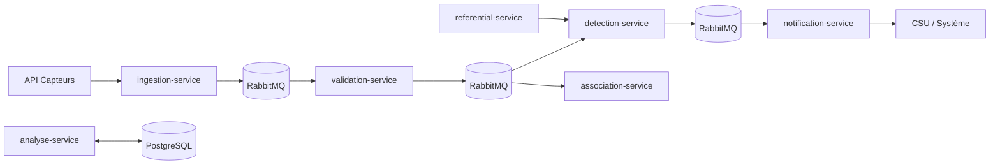

# Architecture UrbanHub

## Vue d’ensemble

UrbanHub suit une architecture microservices orientée événements.

Chaque service est responsable d’un périmètre réduit afin de limiter le couplage, simplifier le déploiement indépendant et rendre les tests plus lisibles.

## Schéma global

## Rôle des services

### `ingestion-service`
- reçoit les mesures brutes
- publie les événements d’entrée dans le bus

### `validation-service`
- consomme les mesures brutes issues de l’ingestion
- vérifie la structure, les champs obligatoires et les valeurs
- republie les mesures validées dans le bus

### `detection-service`
- consomme les mesures validées
- compare les valeurs aux seuils du référentiel
- publie une alerte si un seuil est dépassé

### `association-service`
- consomme les mesures validées
- regroupe les mesures selon des règles métier
- produit des événements corrélés

### `notification-service`
- consomme les alertes émises par la détection
- transmet les notifications à un système externe

### `referential-service`
- fournit les seuils et règles métier
- sert de source de référence aux services consommateurs

### `analyse-service`
- persiste et expose les analyses métiers
- s’appuie sur PostgreSQL pour la consultation

## Bus d’événements

RabbitMQ est le point d’échange central.

Flux logique documenté:
- `ingestion-service` publie les données brutes
- `validation-service` consomme ces données, les contrôle puis republie les données validées
- `detection-service` et `association-service` consomment les données validées
- `notification-service` consomme les alertes de `detection-service`

Ce découpage permet:
- le découplage entre producteurs et consommateurs
- le traitement asynchrone
- la montée en charge par service
- une meilleure isolation des responsabilités

## Stockage

PostgreSQL est utilisé pour les données persistantes et les usages de consultation.

## Pourquoi cette architecture ?

- séparation claire des responsabilités
- déploiement indépendant des services
- meilleure testabilité
- évolutivité du système
- tolérance améliorée aux pics de charge