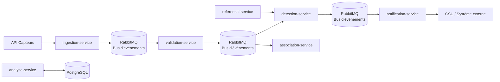

# UrbanHub

UrbanHub est une plateforme microservices orientée événements pour traiter des mesures de capteurs, les valider, détecter les alertes, puis les transmettre à des services spécialisés.

## Vue d’ensemble

Le projet est structuré autour d’un bus d’événements RabbitMQ et de services spécialisés:

- `ingestion-service` reçoit les données brutes
- `validation-service` valide les données à partir du flux d’ingestion
- `detection-service` consomme les mesures validées et produit des alertes
- `association-service` consomme aussi les mesures validées pour produire des corrélations
- `notification-service` consomme les alertes issues de la détection
- `referential-service` fournit les seuils et règles métier
- `analyse-service` expose les analyses et corrélations

## Flux événementiel

## Démarrage rapide

1. Lancer le projet complet: `docker compose up -d --build`
2. Ouvrir Swagger du service de validation: `http://localhost:8002/docs`
3. Ouvrir la documentation MkDocs: `mkdocs serve`

## Accès rapides

- [Architecture](explanation/architecture.md)
- [Tutoriel de démarrage](tutorials/getting-started.md)
- [Référence API](reference/api.md)
- [Variables d’environnement](reference/environment-variables.md)
- [Services](reference/services.md)

## Points clés

- validation des mesures par contrat Pydantic et Swagger
- publication d’événements via RabbitMQ
- consommation asynchrone par les services métiers
- stockage PostgreSQL pour l’analyse et l’historisation

## Diagramme du projet

