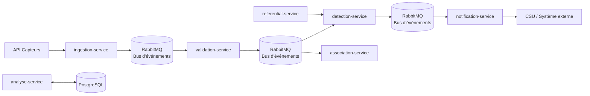

# UrbanHub

UrbanHub est une plateforme microservices orientée événements pour traiter des mesures de capteurs, les valider, détecter les alertes, puis les transmettre à des services spécialisés.

## Vue d’ensemble

Le projet est structuré autour d’un bus d’événements RabbitMQ et de services spécialisés:

- `ingestion-service` reçoit les données brutes
- `validation-service` valide les données à partir du flux d’ingestion
- `detection-service` consomme les mesures validées et produit des alertes
- `association-service` consomme aussi les mesures validées pour produire des corrélations
- `notification-service` consomme les alertes issues de la détection
- `referential-service` fournit les seuils et règles métier
- `analyse-service` expose les analyses et corrélations

## Flux événementiel

## Démarrage rapide

1. Lancer le projet complet: `docker compose up -d --build`
2. Ouvrir Swagger du service de validation: `http://localhost:8002/docs`
3. Ouvrir la documentation MkDocs: `mkdocs serve`

## Accès rapides

- [Architecture](explanation/architecture.md)
- [Tutoriel de démarrage](tutorials/getting-started.md)
- [Référence API](reference/api.md)
- [Variables d’environnement](reference/environment-variables.md)
- [Services](reference/services.md)

## Points clés

- validation des mesures par contrat Pydantic et Swagger
- publication d’événements via RabbitMQ
- consommation asynchrone par les services métiers
- stockage PostgreSQL pour l’analyse et l’historisation

## Diagramme du projet

## Utilisation de l'intelligence artificielle  pour la documentation 
Dans le cadre de ce projet, l'intelligence artificielle a été utilisée pour aider à écrire la documentation technique.
### 📝 Prompts majeurs et audit des réponses

> Pour chaque décision structurante prise avec l'aide de l'IA, voici le prompt à l'origine, un résumé de la réponse obtenue, et la justification de sa validation ou de sa correction.

#### Prompt 1 — [ Restructuration de june_incident.md ]
- **Contexte :** [Le june incident n'etait pas daté et ne correspondait pas à la structure de la documentation. L'IA a été sollicitée pour proposer une restructuration cohérente."]
- **Réponse obtenue :** [La reponse obtenue a permis de restructurer le fichier june_incident.md en suivant la structure de la documentation, en ajoutant des sections claires et en dattant l'incident.]
- **Verdict :** Validé — **Pourquoi :** ["Validé après vérification manuelle, la structure proposée datée est cohérente avec le reste de la documentation et facilite la lecture et la compréhension de l'incident ."]

#### Prompt 2 — [Aide commande mkdocs afin de generer la documentation]
- **Contexte :** [ L'IA a été sollicitée pour générer les commandes nécessaires à l'exécution de mkdocs et pour corriger les diagrammes mermaid afin d'obtenir un diagramme de composant clair et précis.]
- **Réponse obtenue :** [La réponse obtenue a fourni les commandes pour exécuter mkdocs, ainsi que des suggestions pour corriger et améliorer les diagrammes mermaid, permettant d'obtenir un diagramme de composant plus lisible et compréhensible.]
- **Verdict :** Corrigé — **Pourquoi :** ["Après plusieurs essais, les diagrammes mermaid ont été ajustés pour mieux représenter les relations entre les services et les flux d'événements. L'IA a permis de structurer l'information de manière cohérente et accessible, facilitant ainsi la compréhension du système pour les développeurs et les parties prenantes."]

#### Prompt 3 — [Mise à jour du mkdocs.yml pour inclure les nouveaux fichiers et sections]
- **Contexte :** [L'IA a été sollicitée pour aider à mettre à jour le fichier mkdocs.yml afin d'inclure les nouveaux fichiers et sections de la documentation, en s'assurant que la navigation soit claire et intuitive.]
- **Réponse obtenue :** [La réponse obtenue a fourni les commandes pour exécuter mkdocs]
- **Verdict :** Corrigé — **Pourquoi :** [" Après plusieurs essais, le fichier mkdocs.yml a été ajusté pour inclure les nouveaux fichiers et sections de la documentation. L'IA a permis de structurer l'information de manière cohérente et accessible, facilitant ainsi la navigation et la compréhension du système pour les développeurs et les parties prenantes."]

#### Prompt 4 — [Mise à jour du diagramme mermaid de composant]
- **Contexte :** [L'IA a été sollicitée pour aider à mettre à jour le diagramme  de composant codé en mermaid, en s'assurant que la navigation soit claire et intuitive.]
- **Réponse obtenue :** [Il a été proposé de corriger et améliorer le diagramme mermaid, permettant d'obtenir un diagramme de composant plus lisible et compréhensible.]
- **Verdict :** Corrigé — **Pourquoi :** ["Après plusieurs essais, les diagrammes mermaid ont été ajustés pour mieux représenter les relations entre les services et les flux d'événements. L'IA a permis de structurer l'information de manière cohérente et accessible, facilitant ainsi la compréhension du système pour les développeurs et les parties prenantes."]

#### Prompt 5 — [Restructuration des fichiers de documentation pour une meilleure lisibilité]
- **Contexte :** [De base, la documentation etait seulement dans le readme.me et après avoir vu le documentation de diataxis, j'ai demandé à l'IA demaider à restructurer les fichiers de documentation pour une meilleure lisibilité et organisation.]
- **Réponse obtenue :** [ L'IA a proposé une structure de documentation basée sur le modèle Diátaxis, en séparant les fichiers en sections distinctes pour les tutoriels, les explications, les références et les guides pratiques. Cette restructuration a permis d'améliorer la lisibilité et l'organisation de la documentation, facilitant ainsi la navigation et la compréhension pour les utilisateurs.]
- **Verdict :** Validé — **Pourquoi :** ["Validé après vérification manuelle, la structure proposée est cohérente avec le modèle Diátaxis et facilite la lecture et la compréhension de la documentation."]

### Prompt 6 — [Aide à la rédaction de changelog]
- **Contexte :** [L'IA a été sollicitée pour aider à rédiger un changelog clair et structuré à partir de commits, en mettant en évidence les modifications apportées au projet et en facilitant la compréhension des évolutions pour les utilisateurs.]
- **Réponse obtenue :** [La réponse obtenue a fourni un exemple de changelog structuré, avec des sections distinctes pour les nouvelles fonctionnalités, les corrections de bugs et les améliorations. Cela a permis de créer un changelog clair et compréhensible pour les utilisateurs, facilitant ainsi la communication des évolutions du projet.]
- **Verdict :** Corrigé — **Pourquoi :** ["Après plusieurs essais, le changelog a été ajusté pour mieux représenter les modifications apportées au projet. L'IA a permis de structurer l'information de manière cohérente et accessible, facilitant ainsi la compréhension des évolutions pour les utilisateurs et les parties prenantes."]