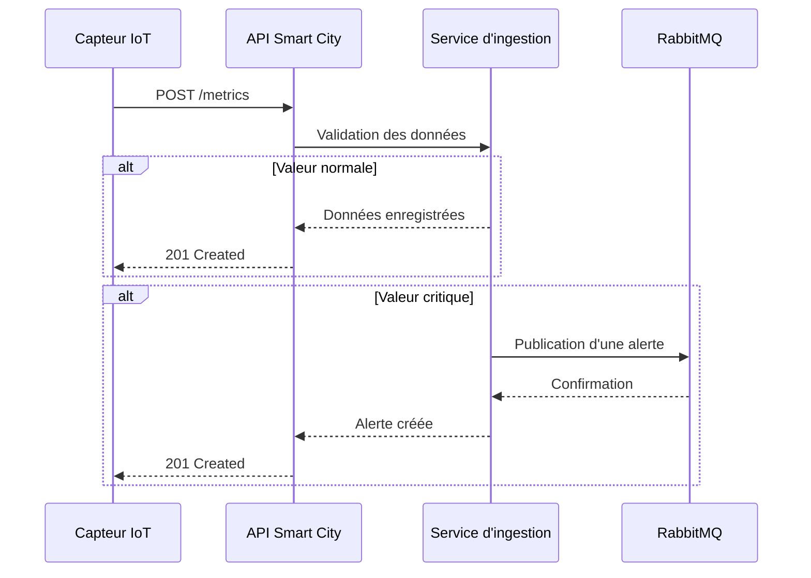
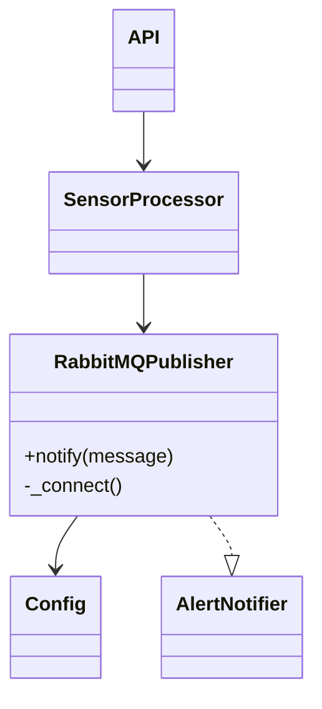

# 🚦 Smart City IoT


Projet réalisé dans le cadre du fil rouge **Smart City**.

Cette application collecte les données provenant de capteurs IoT, les valide, les stocke et déclenche automatiquement des alertes lorsqu'un seuil critique est dépassé.

---

# 📚 Sommaire

- Présentation
- Structure du projet
- Architecture
- Fonctionnalités
- Documentation API
- Installation
- Lancement
- Tests
- Diagrammes UML
- Technologies utilisées
- Données et journaux
- Auteur

---

# 📁 Structure du projet

```text
Api_ingestion/
│
├── api/
├── ingestion/
├── messaging/
├── monitoring/
├── models/
├── services/
├── data/
├── logs/
│
tests/
│
pyproject.toml
README.md
```

---

# 🏛️ Architecture

Le projet est organisé autour de plusieurs composants :

- **api/** : expose les endpoints REST.
- **ingestion/** : collecte les données provenant des capteurs.
- **services/** : contient la logique métier.
- **messaging/** : communication avec RabbitMQ.
- **monitoring/** : supervision et alertes.
- **models/** : modèles métier.
- **data/** : stockage des données.
- **logs/** : journalisation de l'application.

---

# 🚀 Fonctionnalités

- ✅ Collecte des mesures IoT
- ✅ API REST
- ✅ Validation des données
- ✅ Gestion des zones, capteurs et métriques
- ✅ Détection des anomalies
- ✅ Génération d'alertes RabbitMQ
- ✅ Journalisation des événements
- ✅ Tests unitaires avec Pytest

---

# 📄 Documentation API

Le contrat OpenAPI est disponible dans :

```text
docs/api/swagger.yaml
```

Des exemples de requêtes sont disponibles dans :

```text
docs/api/examples.json
```

---

# ⚙️ Installation

### Cloner le dépôt

```bash
git clone <url_du_projet>
cd ProjetFilRougeEADL
```

### Installer les dépendances

```bash
poetry install
```

---

# ▶️ Lancer l'application

```bash
poetry run python Api_ingestion/main.py
```

---

# 🧪 Exécuter les tests

Tous les tests :

```bash
poetry run pytest
```

Un test spécifique :

```bash
poetry run pytest tests/test_publisher.py -v
```

---

# 📡 Diagramme de séquence



---

# 📦 Diagramme de classes



---

# 🛠️ Technologies utilisées

- Python 3.11
- Poetry
- FastAPI
- RabbitMQ
- Pytest
- Pydantic
- Mermaid
- OpenAPI (Swagger)

---

# 📂 Données et journaux

Les données générées par l'application sont enregistrées dans :

```text
Api_ingestion/data/
```

Les journaux d'exécution sont enregistrés dans :

```text
Api_ingestion/logs/
```

---

# 👨‍💻 Auteur

Projet réalisé dans le cadre de la formation :

**Architecture Logicielle, Big Data, IA & DevOps**

Fil rouge : **Smart City IoT**